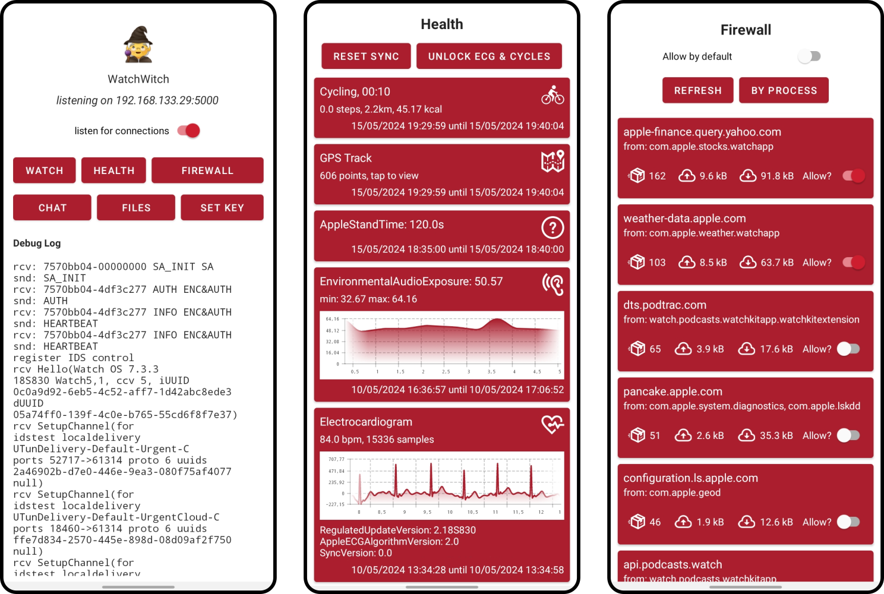

# WatchWitch

WatchWitch is an Android app that allows you to communicate with your Apple Watch. It requires a jailbroken iPhone and a rooted Android phone to set up.

## Features

* The WatchWitch app provides internet access to the watch using the Shoes protocol. Statistics on contacted hosts and data transferred are displayed in the *Firewall* view, which allows you to block selected connections.
* Send text message notifications to the watch (and set up notification forwarding) using the *Chat* view.
* Browse health data collected by the watch in the *Health* view, including ECG charts and GPS tracks.
* View a list of open apps, alarms set, and the ringer state of the watch (only available after sent by the watch).
* Receive and download screenshots taken on the watch and communication transcripts in the *Files* view.

## Screenshots

## Compatibility

WatchWitch is built and tested with an iPhone 8 running iOS 14.8 and an Apple Watch Series 5 running watchOS 7.3.3. You probably have some latitude when it comes to versions and device models. As of watchOS 10, however, the watch only supports _implicit initialization vector_ modes for ESP encryption. These modes are not (yet?) supported on Android/Linux which means we cannot establish the required IPSec tunnel. The Android app is built for API level 33, so any recent Android phone should work.

## Usage

To get your watch to connect to your Android phone, you'll need the WatchWitch iOS app and the WatchWitch iOS tweak. You can find both at [github.com/seemoo-lab/watchwitch-ios](https://github.com/seemoo-lab/watchwitch-ios). You'll also have to grant the WatchWitch Android app root privileges, which are required to set up the IPSec tunnel networking with the watch.

Once you have everything installed, open the WatchWitch apps on both the iPhone and the Android phone. Make sure all devices are connected to the same WiFi network.

Toggle the *listen for connections* switch on the Android phone. The app should should now show the status *"listening on [localip]:5000"*. Enter the local IP of the Android phone in the iOS app and tap *set target IP address*. Then, tap *send keys* to extract cryptographic keys and share them with the Android phone. Before you do so, you may set a custom transit encryption key for these secrets in the iOS app. If you do so, enter the same key in the Android app by tapping *set key*. The Android phone should confirm receipt of the key material in the debug log (*"got keys!"*).

Now, enable the *override WiFi address updates* toggle on the iPhone. The iPhone will now set up the Android phone's IP address with the watch whenever the devices reconnect. If the watch is currently connected, you may tap *force update WiFi address* to perform an update on the spot.

This completes the initial setup. Whenever you want to connect the watch to the Android phone, proceed as follows:

Make sure the devices are still in the same network and the Android app is open and listening. Connect the watch to the iPhone over Bluetooth as usual (i.e. turn on the watch, enable Bluetooth on both the iPhone and the watch). After a few seconds, disable Bluetooth completely on the iPhone (the quick settings tile is not sufficient to do this).

The watch will now connect to the Android phone *when it chooses to*. To force the watch to reconnect, you may trigger a "find my" ping from the watch's quick settings view, which will cause it to realize that the Bluetooth link is down and attempt a WiFi connection. You should see output in the debug log of the Android app confirming that a connection is being established.

For a successful connection, you should see several *SetupChannel* messages in the debug log. Once connected, you should be able to use all features of the app.

**Note:** The watch is a moody creature. Taking over the connection from an iPhone stretches the intended use case of the involved protocols a fair bit, and can get the watch into weird, half-functional states. Especially when re-connecting to the iPhone after being connected to the Android phone, you can expect various features to not work as intended. For best results, reboot the watch, restart the WatchWitch app, and try again.

## Health Sync

The watch only synchronizes health data every now and then. To manually trigger it a sync, you can start a short workout, log some symptom in the cycle tracking app, or take an ECG reading. Once WatchWitch has received some health messages, you can also manually unlock the ECG and cycle tracking app, if you haven't done so before.

## Notification Forwarding

WatchWitch can forward instant messages from your Android phone to your watch. Currently forwarding is only supported for Signal messages. To use this, you'll have to grant the app permission to access your Android notifications. You'll be prompted to do so when you open the *Chat* view. 

Replies you compose on the watch will be sent back *if the watch fully accepts our session*. This is somewhat rare as it requires taking over a session with an unknown ID from the previously connected iPhone. It might take some tries (reconnecting, restarting app & watch) to get a session that works.